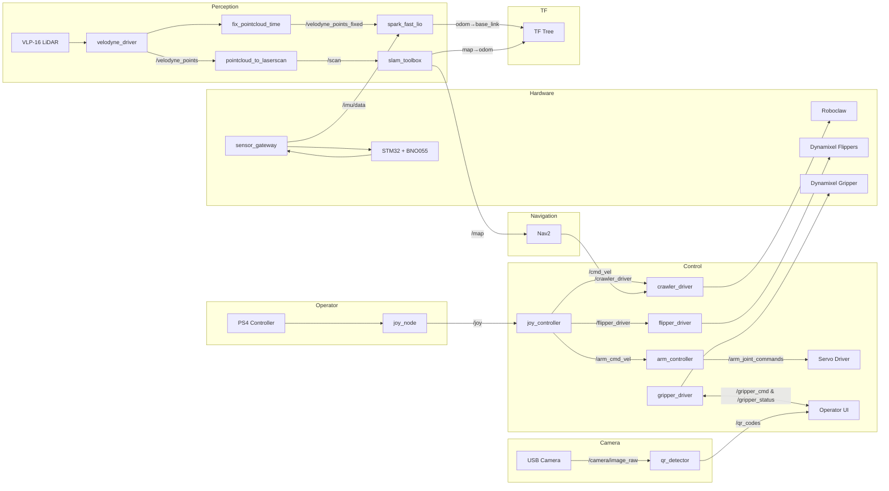

# システムアーキテクチャ

## 目次

1. [プロジェクト概要](#1-プロジェクト概要)
2. [ディレクトリ構成](#2-ディレクトリ構成)
3. [パッケージ詳細](#3-パッケージ詳細)
4. [カスタムメッセージ](#4-カスタムメッセージ)
5. [トピック構成](#5-トピック構成)
6. [TF ツリー](#6-tf-ツリー)
7. [Launch 構成](#7-launch-構成)
8. [設定ファイル一覧](#8-設定ファイル一覧)
9. [データフロー図](#9-データフロー図)
10. [外部サブモジュール](#10-外部サブモジュール)

---

## 1. プロジェクト概要

レスキューロボット「Rustacean RoboRescue」の ROS 2 制御ソフトウェア。

| 項目 | 内容 |
|------|------|
| ROS ディストロ | **Jazzy Jalisco** |
| 言語 | Rust (制御・ドライバ), C++ (テレオペ・走行系), Python (認識・スクリプト) |
| ビルドシステム | colcon + cargo-ament-build + Ninja |
| 環境管理 | Nix flake (`--impure`) |
| RMW | rmw_zenoh_cpp (Zenoh / QUIC) |
| シミュレータ | Gazebo Harmonic (gz sim 8) |
| ハードウェア | VLP-16 LiDAR, BNO055 IMU, Roboclaw, Dynamixel, USB カメラ |

---

## 2. ディレクトリ構成

```
rustacean_roborescue/
├── flake.nix                   # Nix 開発環境 (全依存定義)
├── Justfile                    # ルートコマンド (nix, sync)
├── docs/
│   ├── ARCHITECTURE.md         # 本ドキュメント
│   ├── OPERATION.md            # ビルド・起動・操作マニュアル
│   └── NIX.md                  # Nix セットアップ
├── main_ws/                    # ROS 2 メインワークスペース
│   ├── Cargo.toml              # Rust ワークスペース定義
│   ├── Justfile                # ビルドコマンド (forge, reforge)
│   └── src/
│       ├── bringup/            # Launch, Config, URDF, Scripts
│       ├── control/            # 制御系パッケージ
│       │   ├── arm_controller/     # Rust: 6DOF アーム IK
│       │   └── joy_controller/     # C++: PS4 テレオペ
│       ├── custom_interfaces/  # カスタムメッセージ定義
│       ├── hardware_drivers/   # ハードウェアドライバ
│       │   ├── crawler_driver/     # C++: Roboclaw 走行モータ
│       │   ├── flipper_driver/     # C++: Dynamixel フリッパ
│       │   ├── flipper_driver_rust/ # Rust: Dynamixel フリッパ (代替)
│       │   ├── gripper_driver/     # Rust: Dynamixel グリッパ
│       │   └── sensor_gateway/     # Rust: STM32 IMU ブリッジ
│       ├── perception/         # 認識系パッケージ
│       │   ├── qr_detector/        # Python: QR コード検出
│       │   └── vision_processor/   # Rust: QR デバッグツール (今のところいらない気がする)
│       ├── external/           # Git サブモジュール
│       └── patches/            # パッチファイル
└── stm32_ws/                   # STM32 ベアメタルファームウェア
    └── src/main.rs
```

---

## 3. パッケージ詳細

### 3.1 `joy_controller` — PS4 テレオペレーション

| 項目 | 内容 |
|------|------|
| パス | `main_ws/src/control/joy_controller/` |
| 言語 | C++ |
| ビルド | ament_cmake |
| 依存 | rclcpp, sensor_msgs, geometry_msgs, custom_interfaces |

#### 概要

PS4 コントローラの入力を各アクチュエータの指令値に変換するテレオペノード。STOP / DRIVE / ARM の 3 モードを持ち、ボタンで切り替える。

#### トピック

| 方向 | トピック | 型 |
|------|---------|------|
| Subscribe | `/joy` | sensor_msgs/Joy |
| Publish | `/crawler_driver` | custom_interfaces/CrawlerVelocity |
| Publish | `/flipper_driver` | custom_interfaces/FlipperVelocity |
| Publish | `/arm_cmd_vel` | geometry_msgs/Twist |

#### 動作詳細

- **STOP モード** (PS ボタン): 全出力ゼロ
- **DRIVE モード** (OPTIONS ボタン):
  - 左スティック Y → 左クローラ速度、右スティック Y → 右クローラ速度 (最大 0.7 m/s, デッドゾーン 0.1)
  - D-Pad, ×□, L1/L2/R1/R2 → フリッパ速度 ±1000
- **ARM モード** (SHARE ボタン):
  - 左スティック → XY 並進 (0.3 m/s)、右スティック → Z + Yaw (Z: 0.3 m/s, Yaw: 0.5 rad/s)

#### Launch

`operator_launch.py` で `joy_node` + `joy_controller_node` を一括起動可能。

---

### 3.2 `arm_controller` — 6DOF ロボットアーム逆運動学

| 項目 | 内容 |
|------|------|
| パス | `main_ws/src/control/arm_controller/` |
| 言語 | Rust |
| ビルド | ament_cargo |
| 依存 | rclrs, geometry_msgs, sensor_msgs, `k` (0.32), `urdf-rs` (0.8), anyhow |

#### 概要

6 自由度アームの手先速度指令を受け取り、Damped Least Squares (DLS) 法による速度逆運動学でジョイント速度に変換するノード。

#### ROS パラメータ

| パラメータ | 型 | デフォルト | 説明 |
|-----------|------|-----------|------|
| `urdf_path` | string | `""` (必須) | アーム URDF ファイルパス |
| `end_link` | string | `"link_tip"` | エンドエフェクタのリンク名 |
| `watchdog_timeout_ms` | int | `500` | 指令タイムアウト [ms] |

#### トピック

| 方向 | トピック | 型 |
|------|---------|------|
| Subscribe | `/arm_cmd_vel` | geometry_msgs/Twist |
| Publish | `/arm_joint_commands` | sensor_msgs/JointState (velocity フィールド) |

#### アルゴリズム

1. URDF を `k` クレートで読み込み、エンドエフェクタリンクまでの `SerialChain` を構築
2. 50Hz タイマーで `/arm_cmd_vel` の Twist を $\dot{x} \in \mathbb{R}^6$ に変換
3. ヤコビアン $J$ を `k::jacobian(&chain)` で計算
4. DLS: $\dot{q} = J^T (J J^T + \lambda^2 I)^{-1} \dot{x}$  (λ = 0.05)
5. ジョイント速度を ±1.0 rad/s にクランプ
6. ウォッチドッグ: `watchdog_timeout_ms` 以内に指令がなければ速度ゼロ

#### 補足

- `k::nalgebra` を再エクスポートして使用 (standalone nalgebra との版競合を回避)
- メッシュファイル: `meshes/` 内に STL 11 個 (フリッパ、アームリンク、RealSense)
- アーム URDF: `urdf/sekirei.urdf`

---

### 3.3 `crawler_driver` — Roboclaw 走行モータ制御

| 項目 | 内容 |
|------|------|
| パス | `main_ws/src/hardware_drivers/crawler_driver/` |
| 言語 | C++ |
| ビルド | ament_cmake |
| 依存 | rclcpp, geometry_msgs, custom_interfaces, boost::asio |

#### 概要

Roboclaw モータコントローラとシリアル通信し、左右クローラの速度を制御するドライバノード。テレオペ (`/crawler_driver`) と自律走行 (`/cmd_vel`) の両方に対応。

#### ROS パラメータ

| パラメータ | 型 | デフォルト | 説明 |
|-----------|------|-----------|------|
| `serial_port` | string | `"/dev/roboclaw"` | シリアルポート |
| `crawler_circumference` | double | `0.39` | クローラ周長 [m] |
| `counts_per_rev` | int | `256` | エンコーダカウント / 回転 |
| `gearhead_ratio` | int | `66` | ギアヘッド減速比 |
| `pulley_ratio` | int | `2` | プーリ比 |
| `watchdog_timeout_ms` | int | `500` | 安全停止タイムアウト [ms] |
| `track_width` | double | `0.4` | 左右トラック間距離 [m] |

#### トピック

| 方向 | トピック | 型 | 用途 |
|------|---------|------|------|
| Subscribe | `/crawler_driver` | CrawlerVelocity | テレオペ指令 |
| Subscribe | `/cmd_vel` | geometry_msgs/Twist | Nav2 自律走行指令 |

#### 動作詳細

- **Roboclaw シリアルプロトコル**: CRC16 チェックサム付きバイナリコマンド
- **速度変換**: `counts/s = velocity × (counts_per_rev × gearhead × pulley) / circumference`
- **差動駆動変換** (`/cmd_vel`): `m1 = linear.x - angular.z × track_width / 2`, `m2 = linear.x + angular.z × track_width / 2`
- **PID 定数**: M1 (P=0.464, I=0.021, D=0.0, QPPS=53250), M2 (P=0.438, I=0.020, D=0.0, QPPS=50062)
- **ウォッチドッグ**: 500ms 無指令で全モータ停止

---

### 3.4 `flipper_driver` — Dynamixel フリッパ制御 (C++)

| 項目 | 内容 |
|------|------|
| パス | `main_ws/src/hardware_drivers/flipper_driver/` |
| 言語 | C++ |
| ビルド | ament_cmake |
| 依存 | rclcpp, custom_interfaces, dynamixel_workbench_toolbox |

#### 概要

Dynamixel XM シリーズを Wheel Mode (連続回転) で制御し、4 つのフリッパの速度指令を処理するドライバノード。

#### ROS パラメータ

| パラメータ | 型 | デフォルト | 説明 |
|-----------|------|-----------|------|
| `port_name` | string | `"/dev/dynamixel"` | シリアルポート |
| `baud_rate` | int | `115200` | ボーレート |
| `dynamixel_ids` | int[] | `[1, 2, 3, 4]` | モータ ID (左後, 右後, 左前, 右前) |
| `watchdog_timeout_ms` | int | `500` | 安全停止タイムアウト [ms] |

#### トピック

| 方向 | トピック | 型 |
|------|---------|------|
| Subscribe | `/flipper_driver` | FlipperVelocity |

#### 動作詳細

- `DynamixelWorkbench` ライブラリで Wheel Mode 設定 (速度制限 1023)
- `flipper_vel` 配列のインデックスが Dynamixel ID に対応
- ウォッチドッグで無指令時に全モータ停止

---

### 3.5 `flipper_driver_rust` — Dynamixel フリッパ制御 (Rust 代替)

| 項目 | 内容 |
|------|------|
| パス | `main_ws/src/hardware_drivers/flipper_driver_rust/` |
| 言語 | Rust |
| ビルド | ament_cargo |
| 依存 | rclrs, sensor_msgs, dynamixel2, anyhow, log |

#### 概要

C++ 版 flipper_driver の Rust 代替実装。`dynamixel2` クレートで直接 Dynamixel プロトコルを扱う。

#### トピック

| 方向 | トピック | 型 |
|------|---------|------|
| Subscribe | `/flipper_commands` | sensor_msgs/JointState (velocity) |
| Publish | `/joint_states` | sensor_msgs/JointState (position) |

#### 動作詳細

- **ドライバスレッド**: `mpsc` チャンネルでメインスレッドとハードウェア I/O スレッドを分離 (~20Hz)
- **SyncWrite/SyncRead**: 複数モータへの一括書き込み・読み取りで通信効率化
- **速度制御モード** (Dynamixel Mode 1)
- ジョイント名 → Dynamixel ID マッピングを HashMap で管理
- ハードコード: `/dev/ttyUSB0`, 115200 baud, ID [1,2,3,4]

---

### 3.6 `sensor_gateway` — STM32 IMU シリアルブリッジ

| 項目 | 内容 |
|------|------|
| パス | `main_ws/src/hardware_drivers/sensor_gateway/` |
| 言語 | Rust |
| ビルド | ament_cargo |
| 依存 | rclrs, sensor_msgs, std_msgs, builtin_interfaces, anyhow |
| ソース | `main.rs` (ノード), `imu.rs` (データ構造・変換) |

#### 概要

STM32 マイコンが BNO055 IMU から取得した姿勢データを UART で受信し、ROS 2 の `sensor_msgs/Imu` として配信するブリッジノード。

#### ROS パラメータ

| パラメータ | 型 | デフォルト | 説明 |
|-----------|------|-----------|------|
| `serial_port` | string | `"/dev/stm32"` | STM32 シリアルデバイス |
| `baud_rate` | int | `115200` | ボーレート |

#### トピック

| 方向 | トピック | 型 |
|------|---------|------|
| Publish | `/imu/data` | sensor_msgs/Imu |

#### 動作詳細

- **シリアル受信スレッド**: CSV 形式 `heading,roll,pitch,sys_cal,gyr_cal,acc_cal,mag_cal` を行単位で読み取り
- **Euler → Quaternion 変換**: ZYX Intrinsic 回転で $(w, x, y, z)$ を計算
- **共分散行列**:
  - Orientation: 対角 0.01 (較正済み推定値)
  - Angular velocity / Linear acceleration: 不明 (先頭 -1.0, REP-145 準拠)
- **タイマー**: ~50Hz で配信、新データがある場合のみ (freshness flag)
- **キャリブレーション**: 50 メッセージごとにログ出力
- **自動再接続**: シリアルエラー時に 2 秒待って再試行
- **ユニットテスト**: CSV パース・四元数変換のテスト付き

---

### 3.7 `gripper_driver` — Dynamixel グリッパ (電流位置制御)

| 項目 | 内容 |
|------|------|
| パス | `main_ws/src/hardware_drivers/gripper_driver/` |
| 言語 | Rust |
| ビルド | ament_cargo |
| 依存 | rclrs, std_msgs, sensor_msgs, custom_interfaces, dynamixel2, anyhow |

#### 概要

Dynamixel の **電流ベース位置制御モード** (Mode 5) でグリッパを制御する。電流制限による把持力制御と、状態マシンによる把持状態フィードバックを提供する。

#### ROS パラメータ

| パラメータ | 型 | デフォルト | 説明 |
|-----------|------|-----------|------|
| `port_name` | string | `"/dev/ttyUSB1"` | シリアルポート |
| `baud_rate` | int | `115200` | ボーレート |
| `motor_id` | int | `10` | Dynamixel モータ ID |

#### トピック

| 方向 | トピック | 型 |
|------|---------|------|
| Subscribe | `/gripper_cmd` | custom_interfaces/GripperCommand |
| Publish | `/gripper_status` | custom_interfaces/GripperStatus |

#### 状態マシン

| 状態 | 条件 | 説明 |
|------|------|------|
| **IDLE** | 目標位置に到達 & 低電流 | 停止中 |
| **MOVING** | 目標位置未到達 & 低電流 | 移動中 |
| **GRIPPING** | 電流 > 200mA | 物体を把持中 |
| **OVERLOAD** | 電流 > 800mA | 過電流保護 (位置保持) |
| **ERROR** | ハードウェア障害 | 異常 |

#### 動作詳細

- ハードウェアスレッドが ~20Hz で位置・電流・温度を読み取り、状態を判定してパブリッシュ
- 位置閾値: 50 raw units, 把持電流閾値: 200mA

---

### 3.8 `qr_detector` — QR コード検出

| 項目 | 内容 |
|------|------|
| パス | `main_ws/src/perception/qr_detector/` |
| 言語 | Python |
| ビルド | ament_python |
| 依存 | rclpy, sensor_msgs, std_msgs, cv_bridge |

#### 概要

OpenCV の WeChatQRCode デテクタを使い、カメラ画像から QR コードを検出・デコードするノード。検出結果のテキストと、バウンディングボックス付きの圧縮画像をパブリッシュする。

#### ROS パラメータ

| パラメータ | 型 | デフォルト | 説明 |
|-----------|------|-----------|------|
| `model_dir` | string | auto | WeChatQRCode モデルディレクトリ |
| `publish_compressed` | bool | `true` | 注釈付き JPEG を配信するか |
| `jpeg_quality` | int | `60` | JPEG 圧縮品質 |
| `detection_interval` | int | `1` | N フレームに 1 回検出 |

#### トピック

| 方向 | トピック | 型 | QoS |
|------|---------|------|-----|
| Subscribe | `/camera/image_raw` | sensor_msgs/Image | BEST_EFFORT |
| Publish | `/qr_codes` | std_msgs/String | — |
| Publish | `/image/compressed` | sensor_msgs/CompressedImage | — |

#### 動作詳細

- Caffe モデル 4 ファイル (`models/` ディレクトリ) を使用
- `detection_interval` でフレームスキップ (計算負荷低減)
- 検出した QR コードにバウンディングポリゴンとテキストを描画
- JPEG 圧縮した注釈付き画像をリモート監視用に配信

---

### 3.9 `vision_processor` — QR コードデバッグツール

| 項目 | 内容 |
|------|------|
| パス | `main_ws/src/perception/vision_processor/` |
| 言語 | Rust |
| ビルド | ament_cargo |
| 依存 | opencv (0.92 + clang-runtime + objdetect), rclrs |

#### 概要

スタンドアロンの QR コード検出デバッグツール。カメラを直接 `VideoCapture` で開き、OpenCV の `WeChatQRCode` で検出し、`highgui` で結果を表示する。**ROS ノードではない** (トピック・パラメータなし)。

---

### 3.10 `spark_fast_lio` — LiDAR 慣性オドメトリ

| 項目 | 内容 |
|------|------|
| パス | `main_ws/src/external/spark-fast-lio/` (Git サブモジュール) |
| 言語 | C++ |
| ビルド | ament_cmake + rclcpp_components |

#### 概要

FAST-LIO2 ベースの LiDAR-IMU 融合オドメトリ。VLP-16 のポイントクラウドと BNO055 の IMU データからリアルタイムでロボットの姿勢を推定する。

#### トピック

| 方向 | トピック | 型 |
|------|---------|------|
| Subscribe | `/velodyne_points_fixed` (remapped `lidar`) | sensor_msgs/PointCloud2 |
| Subscribe | `/imu/data` (remapped `imu`) | sensor_msgs/Imu |
| Publish | TF: `odom` → `base_link` | tf2_msgs/TFMessage |

#### 設定 (`spark_fast_lio_min.yaml`)

| パラメータ | 値 | 説明 |
|-----------|------|------|
| `lidar_type` | 2 (VLP-16) | LiDAR 種別 |
| `scan_line` | 16 | スキャンライン数 |
| `scan_rate` | 15 | スキャンレート [Hz] |
| `fov_degree` | 360 | 視野角 |
| `det_range` | 100.0 | 最大検出距離 [m] |
| `blind` | 0.5 | 近距離除外 [m] |
| `filter_size_map` | 0.5 | ダウンサンプリングサイズ [m] |
| `acc_cov` / `gyr_cov` | 0.1 | IMU ノイズ共分散 |

---

### 3.11 `bringup` — Launch / Config / URDF / Scripts

| 項目 | 内容 |
|------|------|
| パス | `main_ws/src/bringup/` |
| 言語 | CMake + Python + URDF/Xacro |
| ビルド | ament_cmake |
| 依存 | rclpy, sensor_msgs, xacro, robot_state_publisher, ros_gz_sim, ros_gz_bridge |

#### 概要

全 Launch ファイル、設定 YAML、URDF モデル、ユーティリティスクリプトを含む統合パッケージ。

#### Launch ファイル

| ファイル | 目的 |
|----------|------|
| `system.launch.py` | マスター: network → perception → control → nav2 を順に起動 |
| `network.launch.py` | `RMW_IMPLEMENTATION=rmw_zenoh_cpp` + `zenohd` デーモン (QUIC/7447, auto-respawn) |
| `control.launch.py` | ドライバ (crawler, flipper, sensor_gateway, gripper) + コントローラ (joy, arm) + qr_detector |
| `perception.launch.py` | spark_fast_lio, velodyne (optional), pointcloud→laserscan, time fix, dummy IMU, slam_toolbox, rviz |
| `nav2.launch.py` | Nav2: controller_server, planner_server, behavior_server, bt_navigator, velocity_smoother, lifecycle_manager |
| `camera.launch.py` | USB カメラ (usb_cam) |
| `simulation.launch.py` | Gazebo Harmonic + ros_gz_bridge + robot_state_publisher + spawn |

#### スクリプト

| ファイル | 目的 |
|----------|------|
| `crawler_vel_bridge.py` | CrawlerVelocity (m1, m2) → Twist (cmd_vel) 変換。`linear.x = (m1+m2)/2`, `angular.z = (m2-m1)/track_width` |
| `dummy_imu_node.py` | 単位姿勢 + 重力加速度の IMU を 100Hz で配信 (テスト用) |
| `fix_pointcloud_time_node.py` | VLP-16 のポイント毎タイムスタンプを方位角から再計算 (1 スキャン = 66.7ms) |

#### URDF (`robot.urdf.xacro`, ~640 行)

シミュレーション用の完全なロボットモデル:

| コンポーネント | 仕様 |
|---------------|------|
| **ベース** | 0.60×0.35×0.15m, 15kg, 差動2輪 + 後部キャスター |
| **フリッパ (×4)** | FR, FL, BR, BL, revolute ジョイント, STL メッシュ |
| **6DOF アーム** | joint1 (Yaw) → joint2 (Shoulder) → joint3 (Elbow) → joint4-6 (Wrist) → link_tip |
| **VLP-16 LiDAR** | gpu_lidar, 1800×16 サンプル, 15Hz |
| **IMU** | 100Hz, ガウシアンノイズ |
| **カメラ** | 640×480, 30fps |

Gazebo Harmonic プラグイン:

| プラグイン | 機能 |
|-----------|------|
| `gz-sim-diff-drive-system` | 差動駆動 (cmd_vel → odom) |
| `gz-sim-joint-state-publisher-system` | 10 ジョイントの状態配信 |
| `gz-sim-joint-position-controller-system` | フリッパ (×4) + アーム (×6) の PID 位置制御 |

---

### 3.12 `custom_interfaces` — カスタムメッセージ定義

| 項目 | 内容 |
|------|------|
| パス | `main_ws/src/custom_interfaces/` |
| 言語 | CMake (rosidl コード生成) |
| ビルド | ament_cmake + rosidl_default_generators |

#### メッセージ

##### `CrawlerVelocity.msg`

```
float32 m1_vel    # 左クローラ速度 [m/s]
float32 m2_vel    # 右クローラ速度 [m/s]
```

##### `FlipperVelocity.msg`

```
int32[] flipper_vel   # [左後, 右後, 左前, 右前] エンコーダ単位
```

##### `GripperCommand.msg`

```
uint16 position       # 目標位置 [Dynamixel 単位]
uint16 max_current    # 最大電流制限 [mA]
```

##### `GripperStatus.msg`

```
uint8 IDLE=0
uint8 MOVING=1
uint8 GRIPPING=2
uint8 OVERLOAD=3
uint8 ERROR=4

uint8  state          # 状態定数
int32  position       # 現在位置
int16  current        # 現在電流 [mA]
uint8  temperature    # 温度 [°C]
```

---

### 3.13 `stm32_ws` — STM32 ファームウェア

| 項目 | 内容 |
|------|------|
| パス | `stm32_ws/` |
| 言語 | Rust (ベアメタル) |
| ターゲット | `thumbv7em-none-eabihf` (STM32F446) |
| 依存 | cortex-m, cortex-m-rt, panic-halt, embedded-hal, stm32f4xx-hal |

#### 概要

STM32F446 上で BNO055 IMU を I2C で読み取り、CSV 形式で UART 出力するベアメタルファームウェア。`sensor_gateway` ノードがこの UART データを受信する。

---

## 4. カスタムメッセージ

(→ セクション 3.12 参照)

---

## 5. トピック構成

### 5.1 制御系トピック

| トピック | 型 | Publisher | Subscriber |
|----------|------|-----------|------------|
| `/joy` | sensor_msgs/Joy | joy_node | joy_controller |
| `/crawler_driver` | CrawlerVelocity | joy_controller | crawler_driver |
| `/flipper_driver` | FlipperVelocity | joy_controller | flipper_driver |
| `/arm_cmd_vel` | geometry_msgs/Twist | joy_controller | arm_controller |
| `/arm_joint_commands` | sensor_msgs/JointState | arm_controller | (servo driver) |
| `/joint_states` | sensor_msgs/JointState | flipper_driver / Gazebo | (RViz) |
| `/gripper_cmd` | GripperCommand | (operator) | gripper_driver |
| `/gripper_status` | GripperStatus | gripper_driver | (operator) |
| `/cmd_vel` | geometry_msgs/Twist | Nav2 / ros_gz_bridge | crawler_driver / Gazebo |

### 5.2 認識系トピック

| トピック | 型 | Publisher | Subscriber |
|----------|------|-----------|------------|
| `/velodyne_points` | PointCloud2 | velodyne / Gazebo | pointcloud_to_laserscan, fix_pointcloud_time |
| `/velodyne_points_fixed` | PointCloud2 | fix_pointcloud_time | spark_fast_lio |
| `/imu/data` | sensor_msgs/Imu | sensor_gateway / Gazebo | spark_fast_lio |
| `/scan` | LaserScan | pointcloud_to_laserscan | slam_toolbox, Nav2 |
| `/map` | OccupancyGrid | slam_toolbox | Nav2 |
| `/odom` | Odometry | spark_fast_lio / Gazebo | — |

### 5.3 カメラ系トピック

| トピック | 型 | Publisher | Subscriber |
|----------|------|-----------|------------|
| `/camera/image_raw` | Image | usb_cam / Gazebo | qr_detector |
| `/camera/camera_info` | CameraInfo | usb_cam / Gazebo | — |
| `/qr_codes` | std_msgs/String | qr_detector | (operator) |
| `/image/compressed` | CompressedImage | qr_detector | (operator) |

### 5.4 シミュレーション固有

| トピック | 型 | Publisher | Subscriber |
|----------|------|-----------|------------|
| `/clock` | rosgraph_msgs/Clock | Gazebo (ros_gz_bridge) | 全ノード (use_sim_time) |

---

## 6. TF ツリー

### 実機

```
map                ← slam_toolbox
 └─ odom           ← spark_fast_lio
     └─ base_link
         ├─ velodyne       ← static_transform_publisher
         ├─ imu_link       ← URDF (fixed)
         ├─ camera_link    ← URDF (fixed)
         ├─ flipper_*_link ← URDF (revolute)
         └─ arm_base_link
             └─ arm_link1 → ... → link_tip
```

### シミュレーション

```
(map)              ← slam_toolbox (オプション)
 └─ odom           ← Gazebo DiffDrive plugin (via ros_gz_bridge)
     └─ base_footprint
         └─ base_link
             ├─ left_wheel / right_wheel
             ├─ velodyne_link
             ├─ imu_link
             ├─ camera_link
             ├─ flipper_*_link (×4)
             └─ arm_base_link → arm_link1-6 → link_tip
```

### フレーム役割

| フレーム | 説明 |
|----------|------|
| `map` | SLAM 地図座標系 (グローバル, ドリフト補正済み) |
| `odom` | オドメトリ座標系 (連続だがドリフトする) |
| `base_footprint` | 地面投影点 (シミュレーション) |
| `base_link` | ロボット本体中心 |
| `velodyne` / `velodyne_link` | VLP-16 LiDAR 取付位置 |
| `link_tip` | アーム先端 (エンドエフェクタ) |

---

## 7. Launch 構成

```
system.launch.py
 ├─ network.launch.py        … Zenoh ルーター (QUIC/7447)
 ├─ perception.launch.py     … LiDAR + SLAM
 │   ├─ velodyne_driver       (use_velodyne=true 時)
 │   ├─ velodyne_pointcloud   (use_velodyne=true 時)
 │   ├─ fix_pointcloud_time   (use_time_fix=true 時)
 │   ├─ spark_fast_lio
 │   ├─ static_transform_publisher (base_link→velodyne)
 │   ├─ pointcloud_to_laserscan (use_scan=true 時)
 │   ├─ slam_toolbox           (use_slam=true 時)
 │   ├─ dummy_imu              (use_dummy_imu=true 時)
 │   └─ rviz2                  (use_rviz=true 時)
 ├─ control.launch.py        … ドライバ + コントローラ
 │   ├─ crawler_driver
 │   ├─ flipper_driver
 │   ├─ sensor_gateway
 │   ├─ gripper_driver
 │   ├─ joy_controller
 │   ├─ arm_controller
 │   └─ qr_detector
 └─ nav2.launch.py           … 自律走行 (use_nav2=true 時)
     ├─ controller_server     (RegulatedPurePursuit)
     ├─ planner_server        (SmacPlanner2D)
     ├─ behavior_server
     ├─ bt_navigator
     ├─ velocity_smoother
     └─ lifecycle_manager

simulation.launch.py          … シミュレーション単体
 ├─ gz sim (Gazebo Harmonic)
 ├─ robot_state_publisher
 ├─ create (spawn entity)
 ├─ parameter_bridge (ros_gz_bridge)
 ├─ crawler_vel_bridge
 ├─ joy_controller
 ├─ pointcloud_to_laserscan
 ├─ slam_toolbox              (use_slam=true 時)
 ├─ nav2.launch.py            (use_nav2=true 時)
 └─ rviz2                     (use_rviz=true 時)
```

---

## 8. 設定ファイル一覧

`bringup/config/` 内の全設定ファイル:

| ファイル | 対象 | 主要パラメータ |
|----------|------|----------------|
| `crawler_driver.yaml` | crawler_driver | serial_port, circumference, counts/rev, gearhead, pulley, track_width |
| `flipper_driver.yaml` | flipper_driver | port_name, baud_rate, dynamixel_ids [1,2,3,4], watchdog |
| `arm_controller.yaml` | arm_controller | urdf_path, end_link, watchdog_timeout_ms |
| `sensor_gateway.yaml` | sensor_gateway | serial_port (/dev/stm32), baud_rate (115200) |
| `gripper_driver.yaml` | gripper_driver | port_name, baud_rate, motor_id (10) |
| `nav2_params.yaml` | Nav2 全体 | RegulatedPurePursuit (0.3 m/s), SmacPlanner2D, radius 0.35m, inflation 0.55m |
| `spark_fast_lio_min.yaml` | spark_fast_lio | VLP-16 設定, map_frame: odom, filter_size: 0.5m |
| `pointcloud_to_laserscan.yaml` | pointcloud_to_laserscan | target_frame: base_link, height: -0.2~0.2m |
| `slam_toolbox_async.yaml` | slam_toolbox | Ceres solver, scan_topic: /scan |
| `usb_cam_params.yaml` | usb_cam | /dev/video0, 640×480, 30fps, MJPEG |
| `velodyne_driver.yaml` | velodyne_driver | IP: 10.42.0.242, port: 2368, VLP16, 900 RPM |
| `velodyne_pointcloud.yaml` | velodyne_pointcloud | organized cloud, range: 0.9–130m |
| `zenoh_robot.json5` | zenohd (ロボット) | client, localhost:7447, SHM 有効, no multicast |
| `zenoh_ope.json5` | zenohd (オペレータ) | client, QUIC/robot_IP:7447, no multicast |

---

## 9. データフロー図



詳細なトピック接続図は `topology/system_topology.mmd` を参照。

---

## 10. 外部サブモジュール

`main_ws/src/external/` の Git サブモジュール:

| サブモジュール | 用途 |
|---------------|------|
| `ros2_rust/` | rclrs — Rust 用 ROS 2 クライアントライブラリ |
| `rosidl_rust/` | rosidl_generator_rs — Rust メッセージ生成器 |
| `spark-fast-lio/` | FAST-LIO2 ベース LiDAR 慣性オドメトリ |
| `common_interfaces/` | 標準 ROS 2 メッセージ (std_msgs, sensor_msgs 等) |
| `rcl_interfaces/` | ROS 2 パラメータ・サービスインターフェース |
| `rosidl_defaults/` | rosidl デフォルト生成器 / ランタイム |
| `unique_identifier_msgs/` | UUID メッセージ |
| `test_interface_files/` | テスト用メッセージ定義 |
| `kiss-icp/` | ICP ベースオドメトリ (ビルド対象外) |
